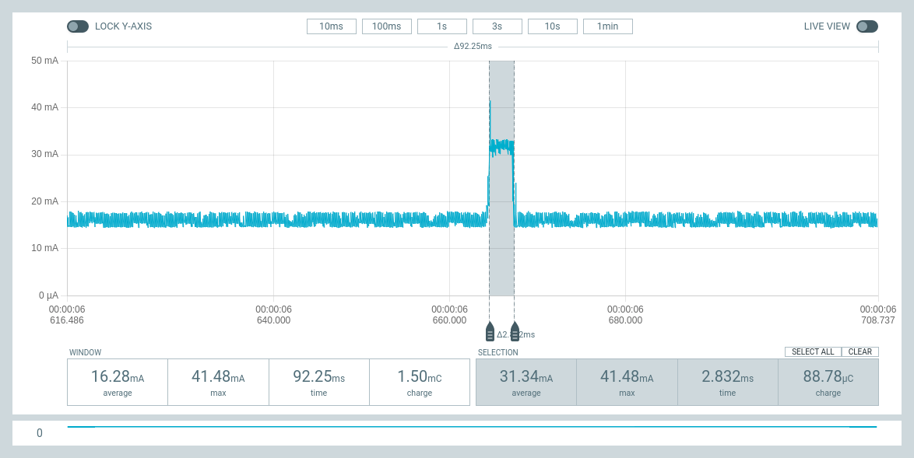
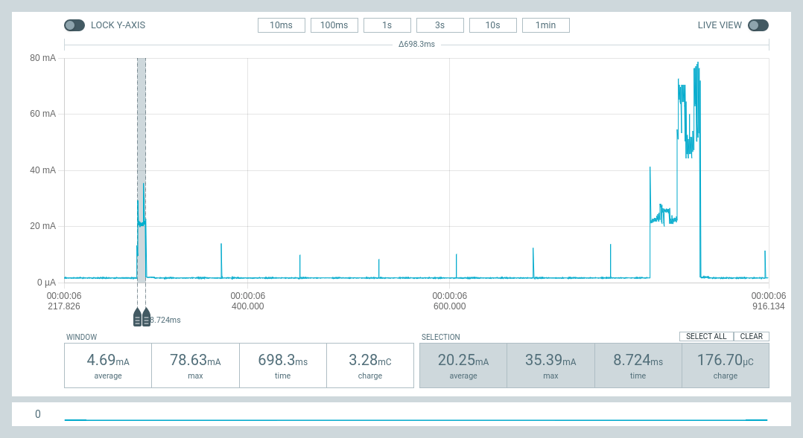
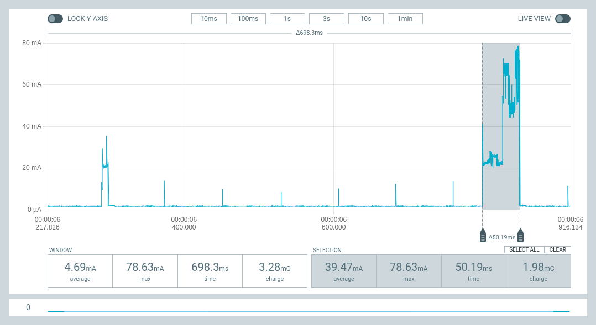

# Using ESP32 Wake stubs

(commit [8e30d80](https://github.com/glenn20/micropython/commit/8e30d80afcd56af38260127fef5c3080b71e8555)
  Add wake stub code to modesp32.c)

(See [Espressif
Docs](https://docs.espressif.com/projects/esp-idf/en/latest/esp32/api-guides/deep-sleep-stub.html)
and examples at <https://gist.github.com/igrr/54f7fbe0513ac14e1aea3fd7fbecfeab>)

> ESP32 supports running a “deep sleep wake stub” when coming out of deep sleep.
This function runs immediately as soon as the chip wakes up - before any normal
initialisation, bootloader, or ESP-IDF code has run. After the wake stub runs,
the SoC can go back to sleep or continue to start ESP-IDF normally.

- Useful for silently counting input pulses or timer based sampling of a GPIO
  input and periodically booting to micropython to send updates via ESPNow or
  Wifi.
- However, there are some severe limitations on what you can do in the wake_stub
  function (see docs).
  - In particular all coding must be in C and access only ESP32 ROM functions.

|   |   |
|---|---|
**ESP32:** Returns to sleep after 2.8ms (~0.044mC)! | 
**ESP32-S3:** Returns to deepsleep after 8.7ms (0.18mC) (4x longer than ESP32) (vs 50.2ms/2.0mC). | 
**ESP32-S3:** Compared with fast boot from deep sleep  of 50ms (2.0mC)). |  
