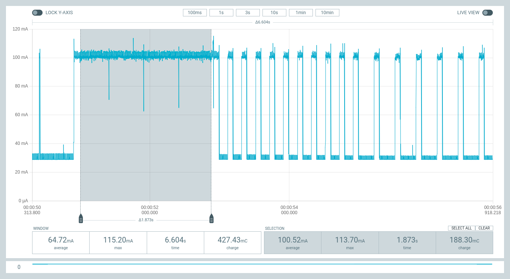
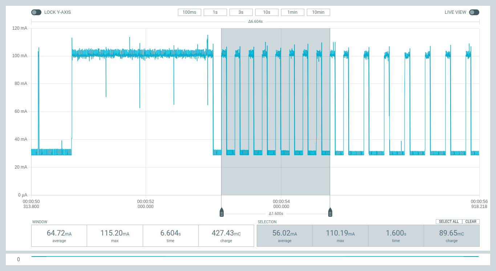
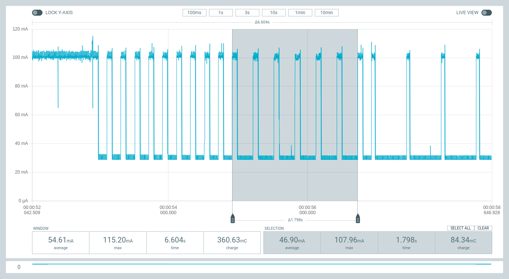
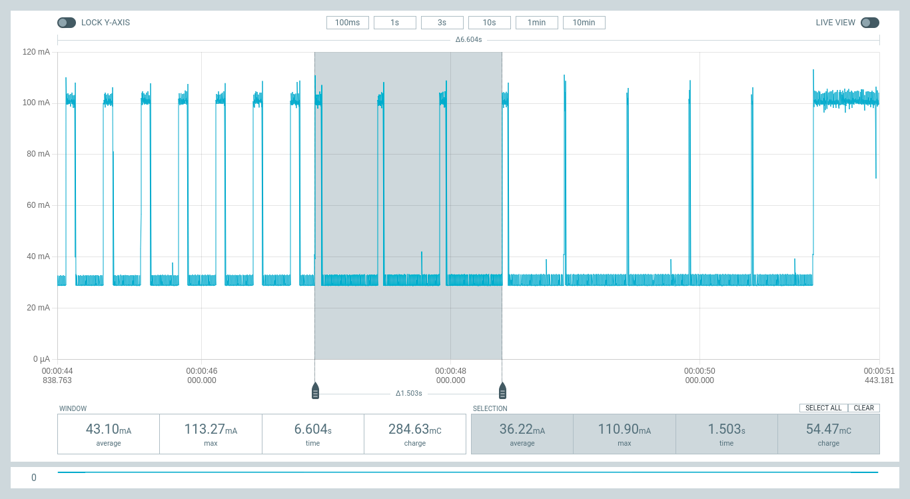
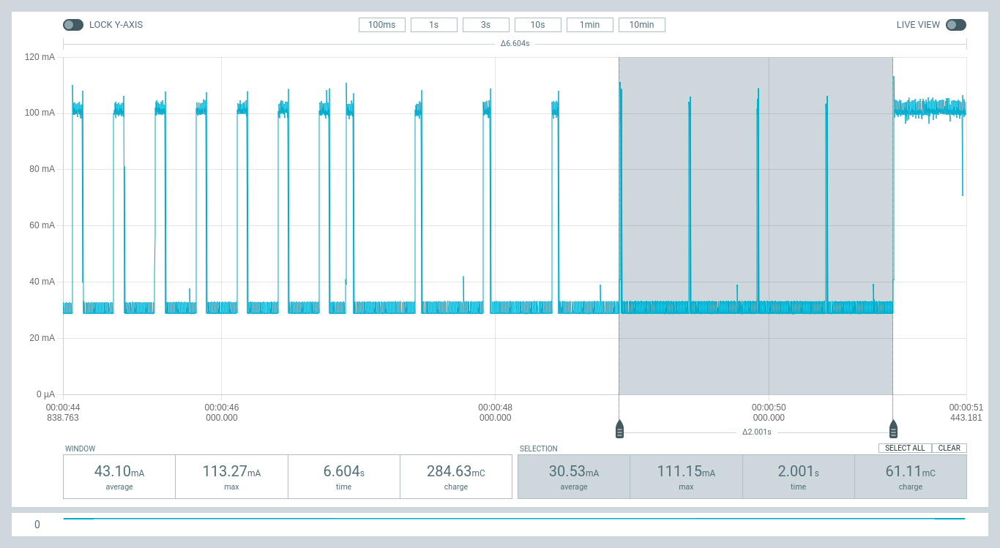
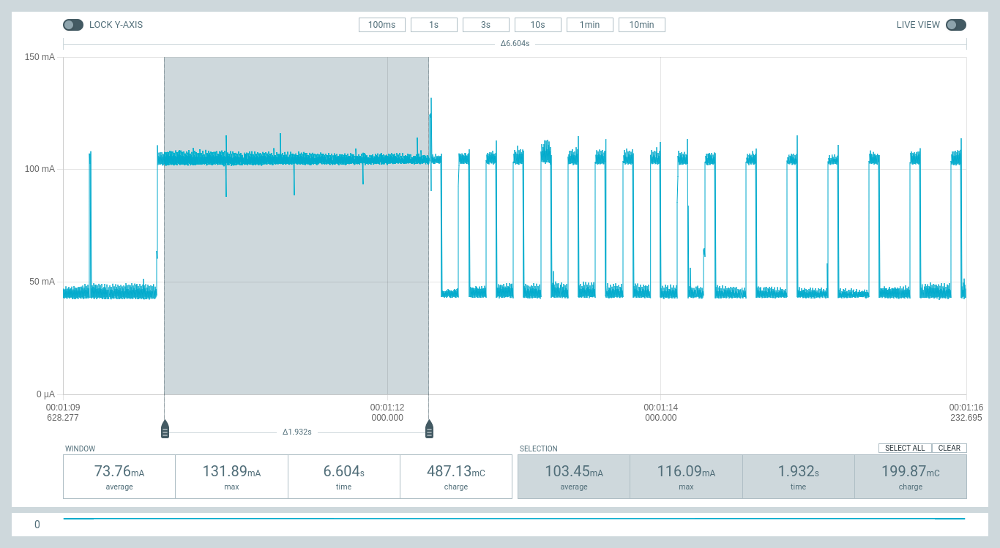
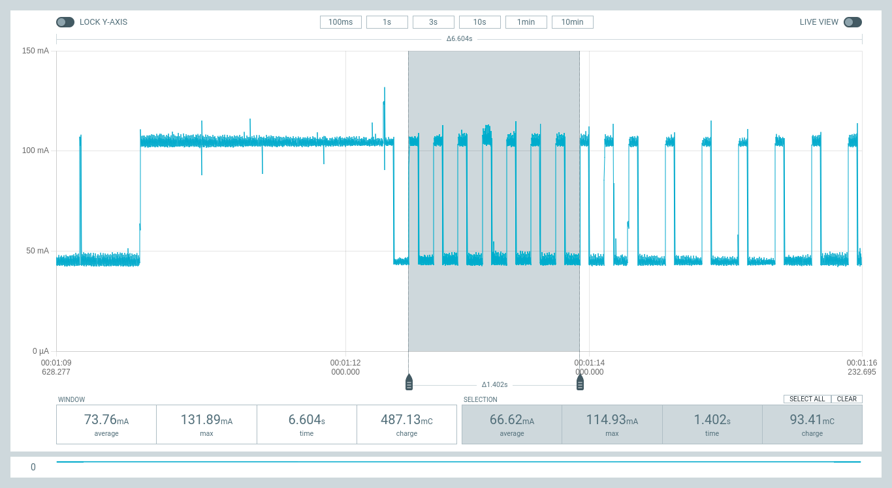
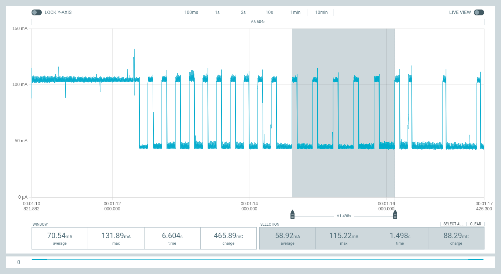
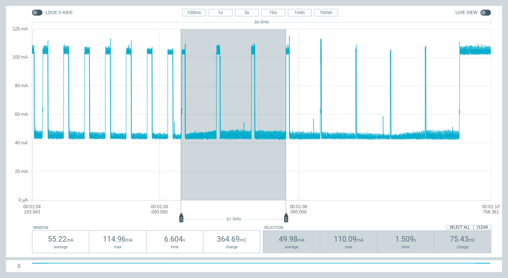
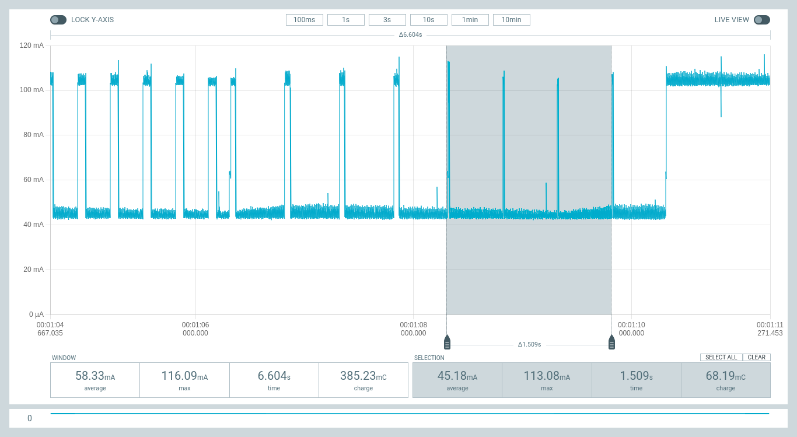

# ESPNOW power management

## Aim

To check and test the new connectionless power management features in ESP IDF
v5.0.2.

## Summary of Results (see below for full data)

### ESP32: (DFRobot Beetle ESP32 module)

| ESPNOW pm setting | Duty Cycle | Current (mA)  | Power (mW)  | % of max |
|---|---:|---:|---:|---:|
 OFF            | 100% | 100 | 330 | 100% |
 `pm=(75, 200)` |  38% | 56 | 185 | 56% |
 `pm=(75, 300)` |  25% | 47 | 155 | 47% |
 `pm=(50, 500)` |  10% | 36 | 119 | 36% |
 `pm=(10, 500)` |   2% | 31 | 102 | 31% |

**Radio OFF:** Current = 28.9mA (95mW)
**Radio ON:** Current = 100mA (330mW)

### ESP32S3: (FeatherS3)

| ESPNOW pm setting | Duty Cycle | Current (mA)  | Power (mW)  | % of max |
|---|---:|---:|---:|---:|
 OFF            | 100% | 103 | 340 | 100% |
 `pm=(75, 200)` |  38% | 67 | 221 | 65% |
 `pm=(75, 300)` |  25% | 57 | 188 | 55% |
 `pm=(50, 500)` |  10% | 50 | 165 | 49% |
 `pm=(10, 500)` |   2% | 45 | 149 | 44% |

**Radio OFF:** Current = 43.8mA (145mW)
**Radio ON:** Current = 104mA (343mW)

## Software

These measurements are based on my micropython `espnow-50-pm` branch at:

- <https://github.com/glenn20/micropython/tree/espnow-50-pm>
  - based on micropython master branch revision: [v1.20.0-246-gc2ea8b2f9]

which includes support for setting the ESPNOW wireless power saving parameters.

- Usage: `e.config(pm=(window, interval))`:

  - every `interval` milliseconds the radio will be turned on for `window`
    milliseconds to listen for incoming messages (`interval` should be a
    multiple of 100ms). Incoming messages will be lost while the radio is off.
    Example:

  ```py
  e.config(pm=(75, 200))  # equivalent to WLAN.config(pm=WLAN.PM_PERFORMANCE)
  e.config(pm=(75, 300))  # equivalent to WLAN.config(pm=WLAN.PM_POWERSAVE)
  ```

  See [Config ESP-NOW Power-saving Parameter](
  https://docs.espressif.com/projects/esp-idf/en/v5.0.2/esp32/api-reference/network/esp_now.html#config-esp-now-power-saving-parameter)

## Hardware

- DFRobot Beetle ESP32 module
- FeatherS3 device from UnexpectedMaker [feathers3.io](https://feathers3.io)
  - Selected for low power consumption and support for my sensors.
- [Power Profiler Kit
  II](https://www.nordicsemi.com/Products/Development-hardware/Power-Profiler-Kit-2)
  to measure power consumption of device during experiments.
  - Also supports visualisation of timing pulses from device pins.
- Cables, computer.

These measurements are made with the PPK2 operating in PSU mode to power the
ESP32 devices.

## Measurements

Measurements are made with module running the following `main.py`:

```py
import time, network, espnow

sta = network.WLAN(0)
e = espnow.ESPNow()
sta.active(1); e.active(1)
pm_values = ((75, 200), (75, 300), (50, 500), (10, 500), (1000, 500))
while True:
    for p in pm_values:
        e.config(pm=p)
        time.sleep(2)
```

### DFRobot Beetle ESP32 module

**Radio OFF:** Current = 28.9mA (95mW)
**Radio ON:** Current = 100mA (330mW)

| ESPNOW pm setting | Average Current (mA)  | PPK2 Screenshot  |
|---|---:|---|
 `pm=(1000, 500)` (disabled) | 100 | 
 `pm=(75, 200)` | 56 | 
 `pm=(75, 300)` | 47 | 
 `pm=(50, 500)` | 36 | 
 `pm=(10, 500)` | 31 | 

### FeatherS3 module

**Radio OFF:** Current = 43.8mA (145mW)
**Radio ON:** Current = 104mA (343mW)

| ESPNOW pm setting | Average Current (mA)  | PPK2 Screenshot  |
|---|---:|---|
 `pm=(1000, 500)` (disabled) | 103 | 
 `pm=(75, 200)` | 67 | 
 `pm=(75, 300)` | 57 | 
 `pm=(50, 500)` | 50 | 
 `pm=(10, 500)` | 45 | 


