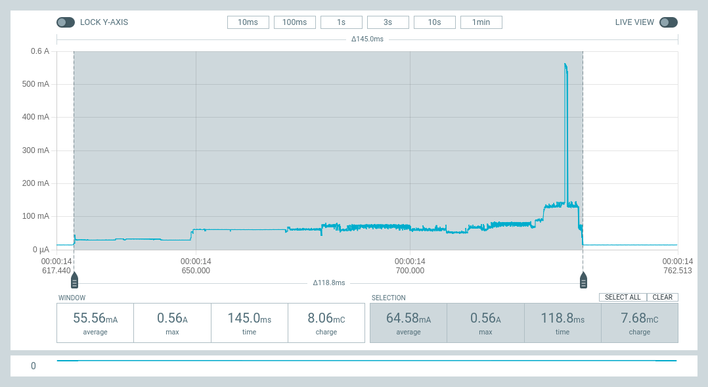
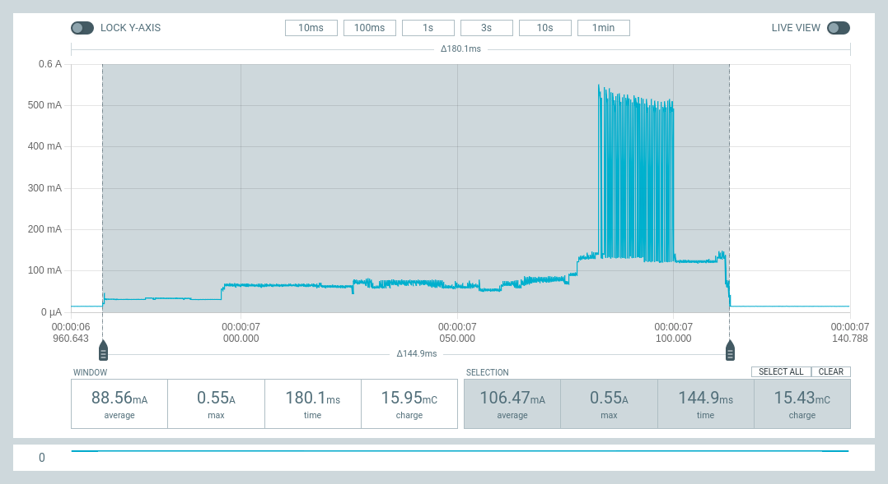
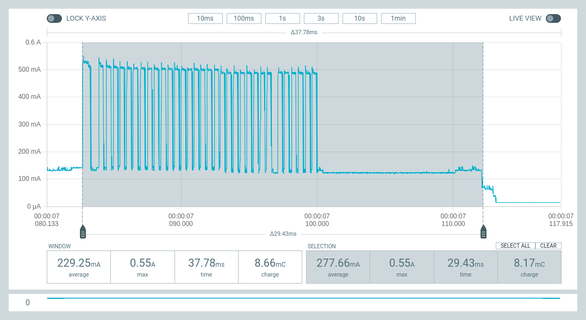
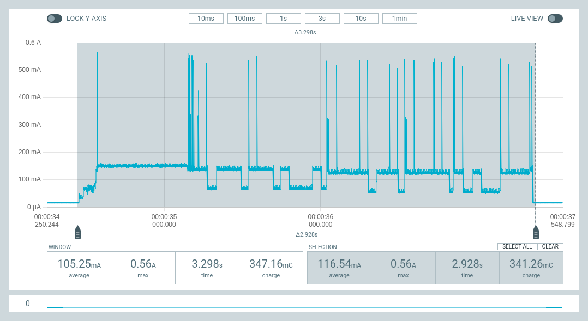
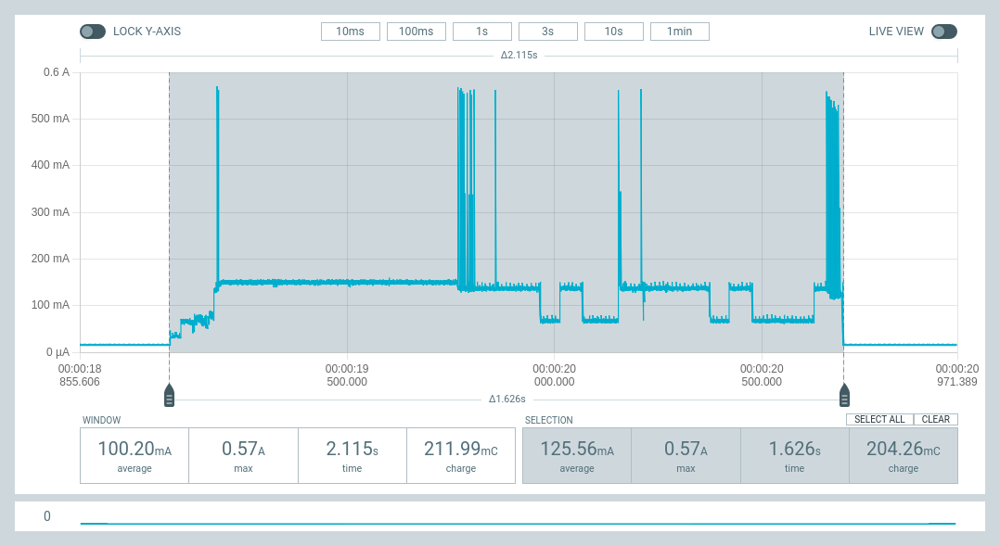
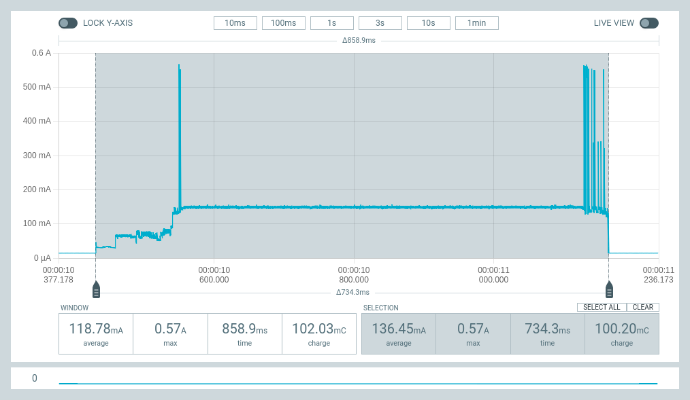

# Compare Boot Time and Energy Consumption for sending Messages via ESPNow and Wifi

We will compare the boot time and energy consumption of ESP32 devices to:

- Wake from deepsleep,
- Boot to Micropython,
- Execute frozen module to:
  - Send a status message via ESPNow or Wifi,
  - Return to deepsleep.

These measurements use the optimised (fast boot) process described in [Optimising Micropython Boot Time](../OptimisingMicropythonBootTime/README.md).

## Summary of Results

**_(Energy (uWh) = 1000 * Charge (mC) * 5V / (60 * 60))_**

| Component | Time (ms) | Charge (mC) | Energy (microWh) |
|---|---:|---:|---:|
| Fast Boot to `_boot.py` only | 70.0 |  3.32 | 4.6 |
| Send ESPNow Succeed | 118.8ms | 7.68 | 10.7 |
| Send ESPNow Failed | 144.9 | 15.4 | 21.4 |
| Connect to wifi (DHCP) and send HTTP Post | 2928 | 341.3 | 474.0 |
| Connect to wifi (DHCP) | 1626 | 204.3 | 283.8 |
| Connect to wifi (Static IP) | 1157 | 165.6 | 230.0 |

## Send status via ESNow from _boot.py (commit [fc62686](https://github.com/micropython/micropython/commit/fc62686524245f9f1b492eb0c978e00375e44d90))

**NOTE:** This commit has `nvs_flash_init()` enabled at boot time as this is
required for `esp_wifi_init()` (additional 7ms of bootup time).

`_preboot.py`:
```python
import machine

def send_state(broker):
    import network
    from _espnow import ESPNow

    enow = ESPNow()
    enow.active(True)
    enow.add_peer(broker)
    sta = network.WLAN(network.STA_IF)
    sta.active(True)
    enow.send(broker, b"wake_up", True)
    enow.active(False)
    sta.active(False)

if machine.reset_cause() == machine.DEEPSLEEP_RESET:
    send_state(b"\xf4\x12\xfaA\xf7T")
    machine.deepsleep(1000)
```

**NOTE:** The ESP32 board has a deepsleep current of 15mA.

|   |   |
|---|---|
**ESP32 Boot, Send ESPNow message:** Time to boot and return to deepsleep is 118.8ms (7.68mC). Sending the message generates a current spike of ~550mA over 0.6ms (1 byte) to 2.5ms (255 bytes). | 
If the peer is not found, the transmission is retried and more energy is consumed: 144.9ms (15.43mC) (twice the energy consumption). Note: Retransmission does **NOT** occur if sending to the broadcast address. |
_| 

## Send status over wifi from _boot.py (commit [44a1341](https://github.com/glenn20/micropython/commit/44a1341147513e7fbe0ccd9c2025869c09d27845))

`_preboot_wifi.py`:

```python
import machine

def send_state(broker):
    import network
    import urequests

    sta = network.WLAN(network.STA_IF)
    sta.active(True)
    sta.connect("ssid", "password")
    while not sta.isconnected():
        pass
    try:
        r = urequests.post("http://XXX.XXX.XXX.XXX:5000/status", data="hello")
    except OSError:
        pass
    sta.disconnect()
    sta.active(False)

if machine.reset_cause() == machine.DEEPSLEEP_RESET:
    send_state()
    machine.deepsleep(1000)
```

NOTES:

- Boot times showed considerable considerable variability with some
  transmissions taking up to 4.9s (490mC).
- Wifi connection and dhcp response times may vary by Access Point.
- You can see the [WIFI_PS_MIN_MODEM power saving mode](https://docs.espressif.com/projects/esp-idf/en/latest/esp32/api-reference/network/esp_wifi.html#_CPPv4N14wifi_ps_type_t17WIFI_PS_MIN_MODEME) at work, where the wifi radio
  is turned off periodically while connected to the Access Point.

|   |   |
|---|---|
**ESP32 Boot, connect to wifi and DHCP, POST message:** Time to boot and return to deepsleep is 2928ms (341.3mC) . | 
**ESP32 Boot, connect to Wifi and DHCP:** Time to connect to wifi and then deepsleep (ie. don't send message) is 1626ms (204.3mC). | 
**ESP32 Wifi connect - static IP:** Time to boot and return to deepsleep is 1157ms (165.6mC) | 
