# Optimising Micropython Boot time on ESP32 devices

## Aim

To optimise the operation of micropython on ESP32 devices for operation as
battery operated sensor devices. In particular, to investigate and optimise:

1. Time (and power consumption) during boot from deepsleep

## Summary of Results (see below for full data)

**_(Energy (uWh) = 1000 * Charge (mC) * 5V / (60 * 60))_**

Measuring time to wake FEATHERS3 (ESP32-S3) device from deepsleep, boot
micropython and return to deepsleep:

| Before Optimisation | Time (ms) | Charge (mC) | Energy (microWh) |
|---|---:|---:|---:|
| Boot to `app_main()` without Validation | 47.0 |  1.7 | 2.4 |
| Validation of Image     | 217  | 14.2 | 19.7 |
| `nvs_flash_init()`      | 7.8  |  0.57 | 0.8 |
| Allocate SPIRAM to GC   | 12.5 |  0.71 | 1.0 |
| Micropython `app_main()` to `_boot.py` | 0.8 | 0.06 | 0.8 |
| `_boot.py` to `main.py` and deepsleep | 350 | 23.6 | 32.8 |
|**Total:** | **635.1** | **41.92** | **58.3** |

| After Optimisation | Time (ms) | Charge (mC) | Energy (microWh) |
|---|---:|---:|---:|
| Boot to `app_main()` without Validation | 47.0 |  1.7 | 2.4 |
| Micropython `app_main()` to `_boot.py` | 0.8 | 0.06 | 0.1 |
| `_boot.py` to deepsleep (`_preboot.py`) | 1.0 | 0.06 | 0.1 |
|**Total:** | **48.8** | **1.82** | **2.5** |

For ESP32 device:

- the optimised boot process takes **70ms (3.32mC)** compared to 48.8ms (2.5mC) for
the ESP32-S3

See [ESP32 Wake Stubs](../ESP32WakeStubs/README.md) for an additional power optimisation
method.

## Software

These experiments are based on my micropython experiments branch at:

- <https://github.com/glenn20/micropython/tree/espnow-g20-boot-tests>
  - based on micropython master branch revision: [v1.19.1-660-gc8913fdbf](https://github.com/micropython/micropython/tree/c8913fdbfadd43c879bba4d6d565be8b644f1feb)

## Hardware

- FeatherS3 device from UnexpectedMaker [feathers3.io](https://feathers3.io)
  - Selected for low power consumption and support for my sensors.
- [Power Profiler Kit
  II](https://www.nordicsemi.com/Products/Development-hardware/Power-Profiler-Kit-2)
  to measure power consumption of device during experiments.
  - Also supports visualisation of timing pulses from device pins.
- Cables, computer.

## Measuring ESP32 boot times and power consumption

These measurements are made with the ESP32 device powered by USB (5V) and the
PPK2 operating in ammeter mode to measure the current on the USB 5V line
powering the ESP32 device. This method does not fully reflect the power
efficiency of the device when running off a LiPoly battery, but is convenient
for reprogramming and controlling the device during the test. The average
current draw for the FeatherS3 device while in deepsleep is 1.73mA (at 5V USB).

See below for final power consumption measurements when the PPK2 is the power
source (simulating a LiPo battery power source).

### Full boot to main.py (unoptimised _naive_ implementation)

`main.py`:

```python
import time
import machine

pin = machine.Pin(18, machine.Pin.OUT)
pin.value(1)

# If we have just woken from a deep sleep go back to sleep
if machine.reset_cause() == machine.DEEPSLEEP_RESET:
    time.sleep_ms(10)
    pin.value(0)
    machine.deepsleep(1000)
```

_Interpreting the images:_

- The greyed numbers show values for current, time and charge within the
selected region.
- The voltage levels for Pin 18 (the boot timing signal pin) are shown in the
  trace lablled `0` at the bottom of the image. These are used to calculate
  timing between key boot events in micropython.

|   |   |
|---|---|
Time to go back to sleep from main.py: 635ms. Power consumption: 41.3mC | 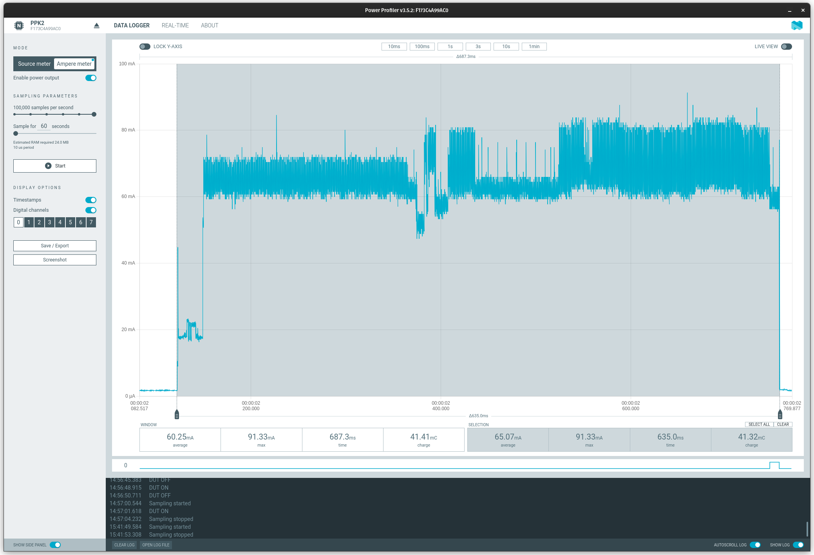
Time to start of micropython `app_main()`: 264ms (15.9mC) |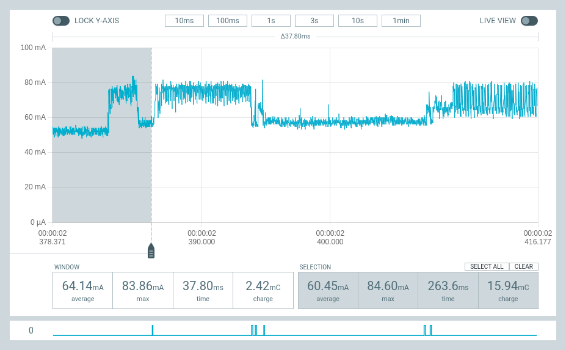
From `app.main()` to end of boardctl_startup() (nvs_flash_init()): 7.8ms (0.57mC) | 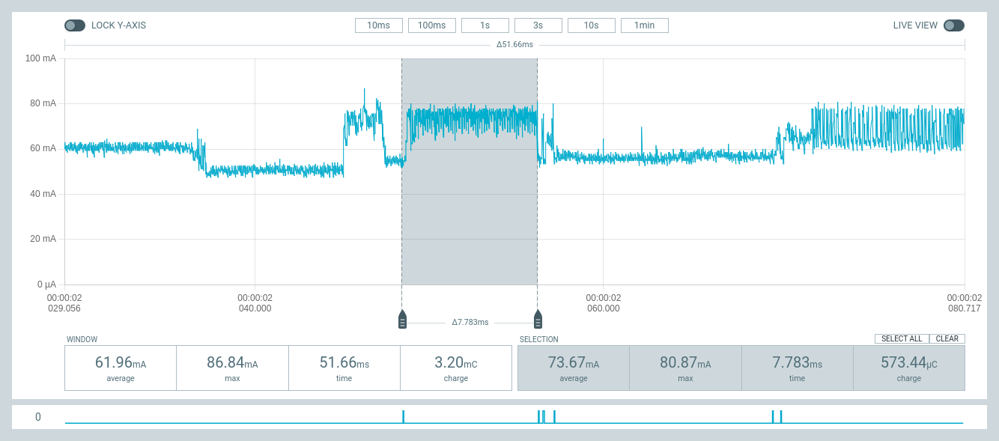
Time to execute gc_init() (with 16MB SPIRAM): 12.5ms (0.71mC) | 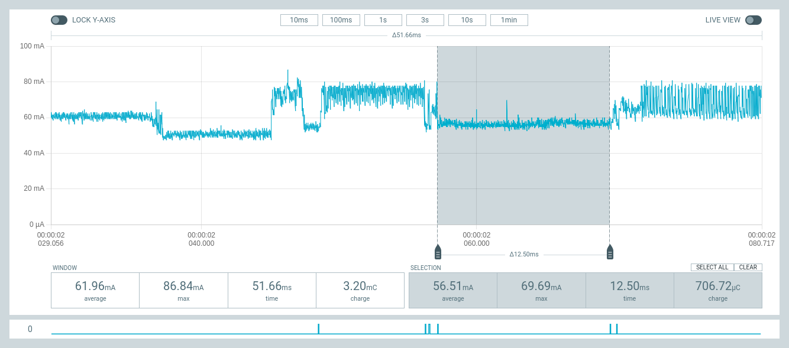
Time from call to load `_boot.py` to execution of deepsleep() in `main.py`:
350ms (23.6mC) | 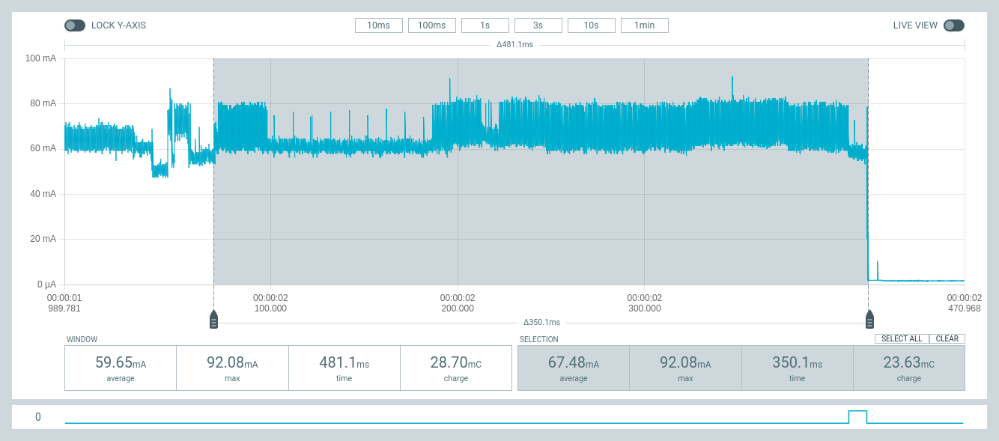

# Optimisation opportunities

## A: Reduce time to boot to `app_main()`: (commit [f2a3c66](https://github.com/glenn20/micropython/commit/f2a3c66ad30784cfc82269a491107befbd0bf8a6))

Add `CONFIG_BOOTLOADER_SKIP_VALIDATE_IN_DEEP_SLEEP=y` to
ports/esp32/boards/sdkconfig.base:

- Disables validation of the micropython image when the device wakes from
  deepsleep (see [Espressif
  Docs](https://docs.espressif.com/projects/esp-idf/en/latest/esp32/api-reference/kconfig.html#config-bootloader-skip-validate-in-deep-sleep)))

|   |   |
|---|---|
**Reduces time to boot to `app_main()` from 264ms to 47.0ms** (15.9mC to 1.71mC) | 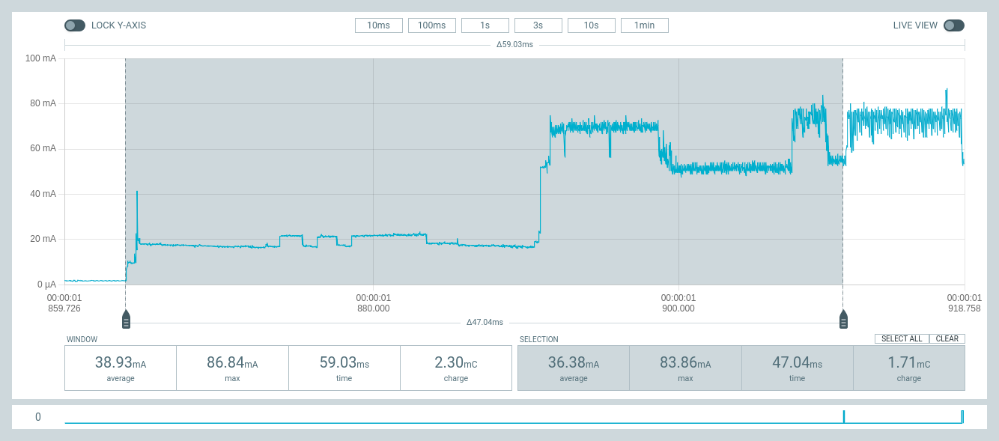
Total boot time back to sleep: 418ms (26.5mC) | 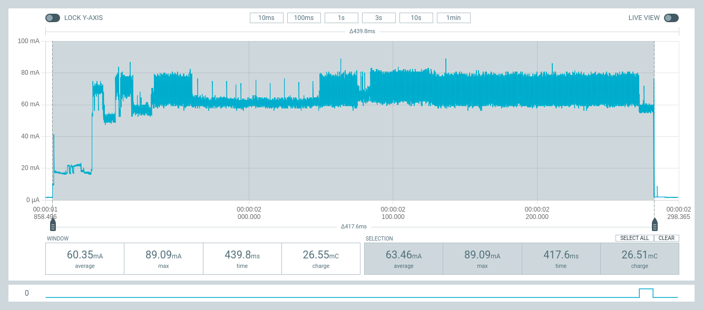

## B: Execute app (deepsleep reboot) from frozen `_boot.py` module: (commit [8154c70](https://github.com/glenn20/micropython/commit/8154c70be59106cff7e0ad5c888479b62971852e))

Moving the code in `main.py` to `ports/esp32/modules/_boot.py` will eliminate
the need to mount and initialise the filesystem on the flash memory before
executing the app.

|   |   |
|---|---|
Time from `_boot.py` back to deepsleep reduced from 350ms (23.6mC) to 1.5ms (0.09mC) | 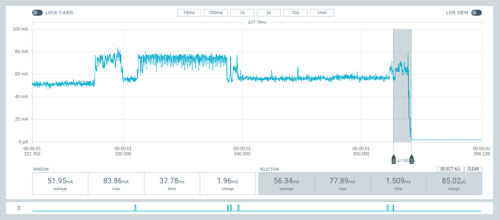
Total time from boot back to deepsleep: 70.4ms (3.17mC) | 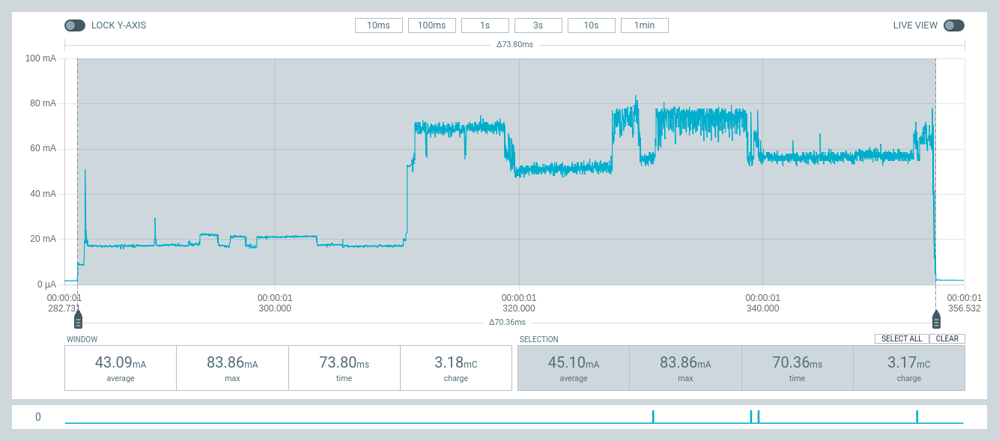

|   |   |
|---|---|
## C: Skip `nvs_flash_init()` on boot if waking from deepsleep: (commit [9bfa464](https://github.com/glenn20/micropython/commit/9bfa4641cfe3f458c183ae88eae787a2cf2de3a7))

**NOTE:** `nvs_flash_init()` must be called before initialising wifi (as RF
calibaration data is read from nvs - EVEN if we disable NVS in the wifi config!!!).

|   |   |
|---|---|
Time for `nvs_flash_init()` reduced from 7.8ms (0.57mC) to 0ms (0mC). (200microseconds is time to generate pulse on logic pin). | 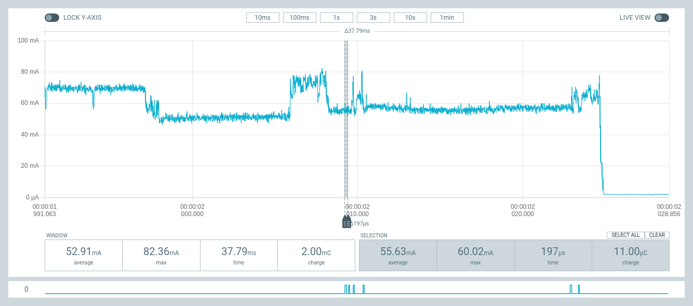

## D: Skip initialisation of SPIRAM on boot if waking from deepsleep: (commit [450b5a3](https://github.com/glenn20/micropython/commit/450b5a308df2e17eb2b740a49f65bb080c665612))

This reduces the work in gc_init() and is only of benefit on devices with
SPIRAM.

NOTE: For most battery operated devices it is unlikely that additional SPIRAM
would be required or be desirable, but I include it here as my testing device
was equipped with SPIRAM.

|   |   |
|---|---|
`gc_init()` time reduced from 12.5ms (0.71mC) to less than 0.1ms. (200 microseconds is time to generate pulse on logic pin.) | 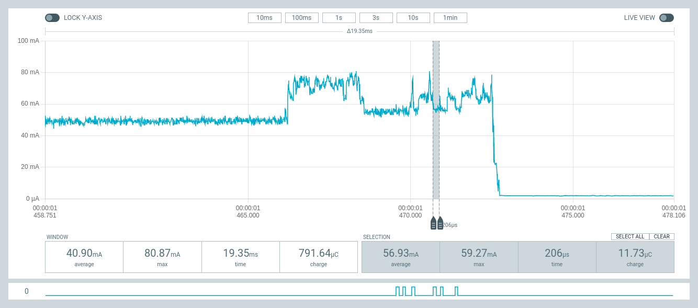

## After all optimisations:

|   |   |
|---|---|
Time from boot to back to deepsleep: 50.0ms (1.87mC) (reduced from 264ms (15.9mC)). (Includes 6 * 0.2 = 1.2ms overhead for generating boot timing signals). | 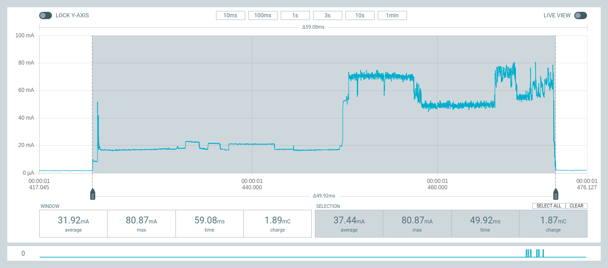

# Optimised code on ESP32 module

**NOTE:** This esp32 module board is not very power efficient (background current =
15.0mA), so take care in comparing with ESP32-S3 module above.

|   |   |
|---|---|
The ESP32 boot from, and return to, deepsleep takes 70ms (3.32mC) compared to 48.8ms (1.82mC) for the ESP32-S3. | 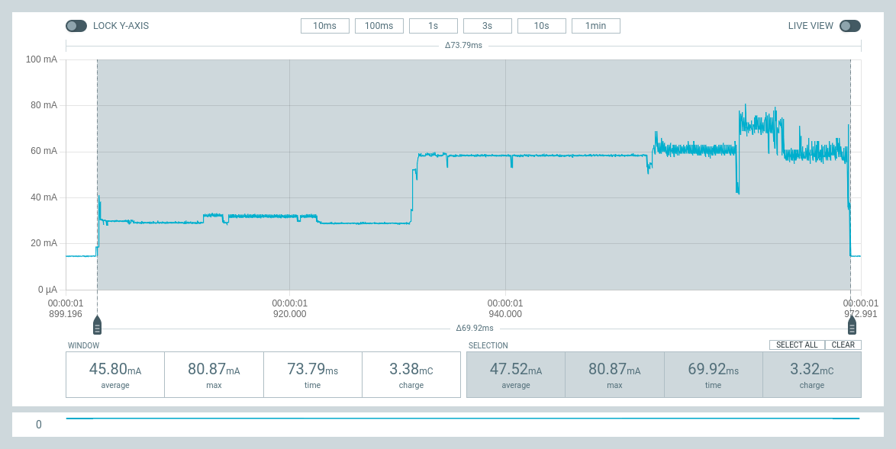
