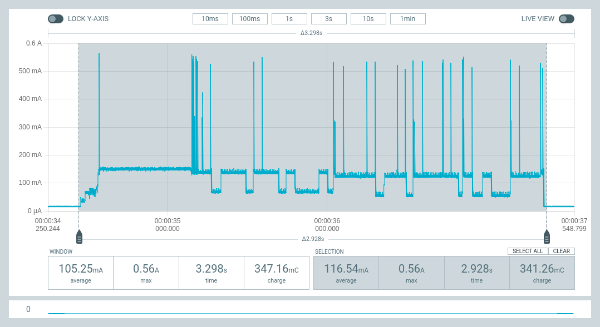

# My Experiments and Measurements with Micropython on ESP32* devices

Here are some of my experiments and measurements on running micropython on
ESP32* devices, including:

- [Optimising Micropython Boot Time](./OptimisingMicropythonBootTime/README.md):
  Optimising the time to boot Micropython from deepsleep mode and returning to
  deepsleep.
- [ESP32 Wake Stubs](./ESP32WakeStubs/README.md): Measuring power consumption
  and time to boot using the ESP32 Wake Stubs.
- [ESPNow vs Wifi Energy Consumption](./ESPNowvsWifiEnergyUsage/README.md):
  Measuring the energy consumed to boot Micropython from deepsleep and send a
  status message to a peer via ESPNow and Wifi.

Comments, suggestions, criticisms and requests are welcome via the Issues or
Discussions tabs above.

NOTE: I was a bit time constrained during these initial measurements, so they
are not as systematic, consistent or clearly presented as I would prefer, but
there are still some useful conclusions to be drawn, so I thought I'd share this
early work.

One big caveat is that most of these initial measurements are made by monitoring
the power consumption on the USB power line which will over-estimate power
consumed when the devices are powered by battery.

## Highlights

Measuring time to wake ESP32-S3 and ESP32 devices from deepsleep, boot micropython and return to deepsleep:

| Wake from deepsleep, boot and return to deepsleep | Time (ms) | Charge (mC) | Energy (microWh) |
|---|---:|---:|---:|
| Unoptimised (boot to main.py) | 635.1 | 41.92 | 58.3 |
| Optimised (boot to frozen _boot.py) | 48.8 | 1.82 | 2.5 |
| Optimised boot and send ESPNow Mesage | 119 | 7.68 | 10.7 |
| Optmised boot and send MQTT message (static IP) | 774 | 108.6 | 150.9 |
| Optmised boot and send MQTT message (DHCP) | 1626 | 204.3 | 283.8 |
| ESP32 Wake Stub |  2.8 |  0.044 | 0.06 |

